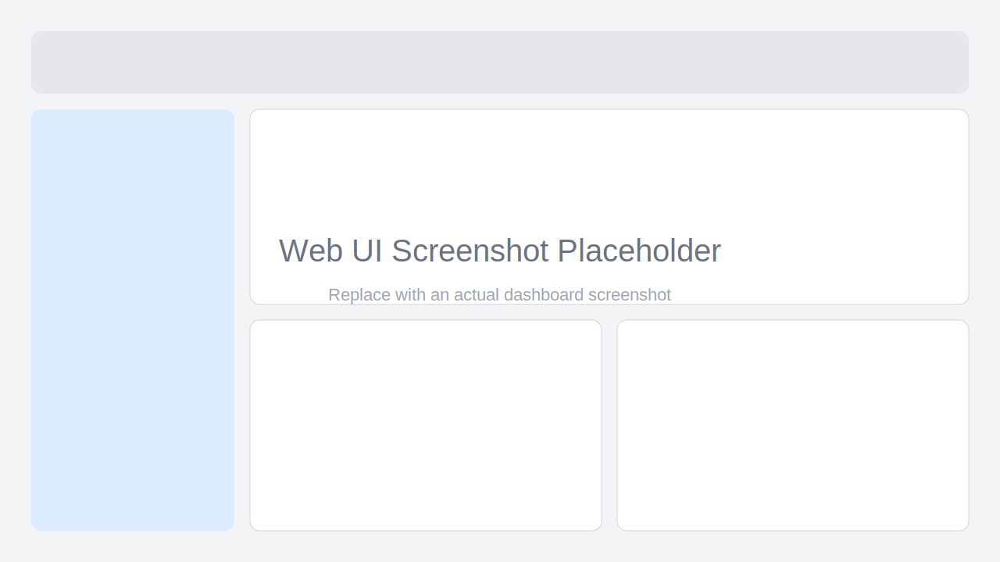

# Goclaw 🦀

<p align="center">
  
  
  
  
</p>

<p align="center">
  <a href="#english">English</a> | 
  <a href="#chinese">中文</a>
</p>

---

<a name="english"></a>
## 🌟 Overview

**Goclaw** is a production-grade, high-performance, distributed-ready multi-Agent orchestration engine written in Go.

It provides a robust framework for building, deploying, and managing intelligent agents that can collaborate seamlessly in distributed environments.

### Key Features

- 🚀 **High Performance** - Built with Go's concurrency model for maximum throughput
- 🏗️ **Distributed Architecture** - Native support for cluster deployment and service discovery
- 🔄 **Agent Orchestration** - Advanced workflow management and task scheduling
- 🌐 **RESTful API** - Complete HTTP API with Swagger documentation
- 📊 **Observability** - Built-in metrics, logging, and tracing support
- 🔌 **Extensible** - Plugin architecture for custom agent behaviors
- 🛡️ **Production Ready** - Comprehensive error handling and fault tolerance

### Quick Start

```bash
# Clone the repository
git clone https://github.com/goclaw/goclaw.git
cd goclaw

# Build the project
make build

# Run tests
make test

# Start the server
make run
```

### Web UI

The built-in Web UI is served by the same Go binary and is enabled by default.

- Open `http://localhost:8080/ui` after starting the server.
- Real-time workflow updates are pushed through `GET /ws/events`.
- In local frontend development, set `ui.dev_proxy` to your Vite dev server (for example `http://localhost:5173`).

**Screenshot (placeholder):**



### Installation

```bash
go get github.com/goclaw/goclaw
```

### Usage Example

```go
package main

import (
    "context"
    "github.com/goclaw/goclaw/pkg/engine"
    "github.com/goclaw/goclaw/config"
    "github.com/goclaw/goclaw/pkg/logger"
)

func main() {
    // Load configuration
    cfg, err := config.Load("config.yaml", nil)
    if err != nil {
        panic(err)
    }

    // Initialize logger
    log := logger.New(&logger.Config{
        Level:  logger.InfoLevel,
        Format: "json",
        Output: "stdout",
    })

    // Create orchestration engine
    eng, err := engine.New(cfg, log)
    if err != nil {
        panic(err)
    }

    // Start the engine
    ctx := context.Background()
    if err := eng.Start(ctx); err != nil {
        panic(err)
    }
    defer eng.Stop(ctx)

    // HTTP API server is now running on port 8080
    // Access Swagger UI at http://localhost:8080/swagger/index.html
}
```

### Configuration

Goclaw uses a flexible configuration system that supports multiple sources:

```yaml
# config.yaml
app:
  name: goclaw
  environment: production

server:
  host: 0.0.0.0
  port: 8080

storage:
  type: badger  # or "memory" for testing
  badger:
    path: ./data/badger
    sync_writes: true
    value_log_file_size: 1073741824  # 1GB

metrics:
  enabled: true
  port: 9091
  path: /metrics

orchestration:
  max_agents: 10
  queue:
    type: memory
    size: 1000
```

**Storage Options:**
- `memory` - In-memory storage (for development/testing)
- `badger` - Persistent embedded database (for production)

**Metrics Configuration:**
- `enabled` - Enable/disable Prometheus metrics collection
- `port` - Metrics server port (default: 9091)
- `path` - Metrics endpoint path (default: /metrics)

**Environment Variables:**
All config values can be overridden with `GOCLAW_` prefix:
```bash
export GOCLAW_SERVER_PORT=9090
export GOCLAW_STORAGE_TYPE=badger
```

For a complete configuration example, see [config/config.example.yaml](config/config.example.yaml).

### HTTP API

Goclaw provides a complete RESTful API for workflow management:

#### API Endpoints

**Workflow Management:**
- `POST /api/v1/workflows` - Submit a new workflow
- `GET /api/v1/workflows` - List all workflows (with pagination)
- `GET /api/v1/workflows/{id}` - Get workflow status
- `POST /api/v1/workflows/{id}/cancel` - Cancel a workflow
- `GET /api/v1/workflows/{id}/tasks/{tid}/result` - Get task result

**Health Checks:**
- `GET /health` - Liveness probe
- `GET /ready` - Readiness probe
- `GET /status` - Detailed status information

**Metrics:**
- `GET /metrics` - Prometheus metrics endpoint (port 9091)

**Documentation:**
- `GET /swagger/index.html` - Interactive API documentation

### gRPC API

Goclaw also provides a high-performance gRPC API (default port: 9090):

#### Services

**WorkflowService** - Core workflow operations
- `SubmitWorkflow` - Submit new workflows
- `ListWorkflows` - List workflows with pagination
- `GetWorkflowStatus` - Get detailed workflow status
- `CancelWorkflow` - Cancel running workflows
- `GetTaskResult` - Retrieve task results

**StreamingService** - Real-time updates
- `WatchWorkflow` - Stream workflow state changes
- `WatchTasks` - Stream task execution events
- `StreamLogs` - Bidirectional log streaming

**BatchService** - Bulk operations
- `SubmitWorkflows` - Submit multiple workflows in parallel
- `GetWorkflowStatuses` - Get statuses for multiple workflows
- `CancelWorkflows` - Cancel multiple workflows
- `GetTaskResults` - Get results for multiple tasks

**AdminService** - Administrative operations
- `GetEngineStatus` - Engine health and metrics
- `UpdateConfig` - Dynamic configuration updates
- `ManageCluster` - Cluster node management
- `PauseWorkflows` / `ResumeWorkflows` - Workflow control
- `PurgeWorkflows` - Clean up old workflows
- `GetLaneStats` - Lane queue statistics
- `ExportMetrics` - Export metrics in various formats
- `GetDebugInfo` - Runtime profiling data

#### Features

- **TLS/mTLS Support** - Secure communication with certificate-based authentication
- **Server Reflection** - Dynamic service discovery for tools like grpcurl
- **Health Checks** - Standard gRPC health check protocol
- **Interceptors** - Authentication, rate limiting, logging, metrics, tracing
- **Connection Pooling** - Efficient connection management
- **Automatic Retry** - Built-in retry logic with exponential backoff

#### Go Client SDK

```go
import "github.com/goclaw/goclaw/pkg/grpc/client"

// Create client
c, err := client.NewClient("localhost:9090",
    client.WithTimeout(30*time.Second),
    client.WithTLS("./certs/ca.crt", "", ""),
)
defer c.Close()

// Submit workflow
workflowID, err := c.SubmitWorkflow(ctx, "my-workflow", tasks)

// Watch workflow progress
eventChan, errChan, err := c.WatchWorkflow(ctx, workflowID, 0)
```

For detailed examples, see:
- [gRPC API Examples](docs/examples/grpc-examples.md)
- [Client SDK Examples](docs/examples/client-sdk-examples.md)
- [TLS/mTLS Setup](docs/examples/tls-setup.md)

#### Quick API Example

```bash
# Submit a workflow
curl -X POST http://localhost:8080/api/v1/workflows \
  -H "Content-Type: application/json" \
  -d '{
    "name": "data-processing",
    "description": "Process customer data",
    "tasks": [
      {
        "id": "task-1",
        "name": "Fetch data",
        "type": "http"
      },
      {
        "id": "task-2",
        "name": "Process data",
        "type": "script",
        "depends_on": ["task-1"]
      }
    ]
  }'

# Get workflow status
curl http://localhost:8080/api/v1/workflows/{workflow-id}

# List all workflows
curl http://localhost:8080/api/v1/workflows?limit=10&offset=0
```

For more examples, see [docs/examples/curl-examples.md](docs/examples/curl-examples.md).

### Monitoring and Observability

Goclaw provides production-grade monitoring with Prometheus metrics:

#### Metrics Endpoint

```bash
# Access metrics
curl http://localhost:9091/metrics
```

#### Available Metrics

**Workflow Metrics:**
- `workflow_submissions_total` - Total workflow submissions by status
- `workflow_duration_seconds` - Workflow execution duration histogram
- `workflow_active_count` - Current active workflows by status

**Task Metrics:**
- `task_executions_total` - Total task executions by status
- `task_duration_seconds` - Task execution duration histogram
- `task_retries_total` - Total task retry attempts

**Lane Queue Metrics:**
- `lane_queue_depth` - Current queue depth by lane
- `lane_wait_duration_seconds` - Task wait time in queue histogram
- `lane_throughput_total` - Total tasks processed by lane

**HTTP API Metrics:**
- `http_requests_total` - Total HTTP requests by method/path/status
- `http_request_duration_seconds` - HTTP request latency histogram
- `http_active_connections` - Current active HTTP connections

**System Metrics:**
- `go_goroutines` - Number of goroutines
- `go_memstats_alloc_bytes` - Memory allocated
- `process_cpu_seconds_total` - CPU time
- `process_open_fds` - Open file descriptors

#### Docker Compose with Monitoring Stack

```bash
# Start Goclaw with Prometheus and Grafana
docker-compose up -d

# Access services
# - Goclaw API: http://localhost:8080
# - Metrics: http://localhost:9091/metrics
# - Prometheus: http://localhost:9092
# - Grafana: http://localhost:3000 (admin/admin)
```

The monitoring stack includes:
- **Prometheus** - Metrics collection and storage
- **Grafana** - Visualization dashboards
- **Alert Rules** - Pre-configured alerts for failures, latency, and resource usage

For detailed monitoring setup, see [config/prometheus.yml](config/prometheus.yml) and [config/grafana/](config/grafana/).

### Distributed Lane and Signal Bus

Goclaw supports Redis-backed queueing and signal delivery for distributed deployment.

#### Distributed Runtime Config

```yaml
orchestration:
  queue:
    type: redis

redis:
  enabled: true
  address: "localhost:6379"

signal:
  mode: redis
  channel_prefix: "goclaw:signal:"
```

When Redis is unavailable, startup falls back automatically to local mode and reports:

- effective queue mode (`redis` or `memory(fallback)`)
- effective signal mode (`redis` or `local(fallback)`)
- redis connection status (`redis_connected`)

See [docs/distributed-lane-guide.md](docs/distributed-lane-guide.md) for configuration details, signal patterns (steer/interrupt/collect), and deployment steps.

### Hybrid Memory System

Goclaw includes a hybrid memory system for intelligent agent memory management, combining vector-based semantic search, BM25 full-text retrieval, and FSRS-6 spaced-repetition decay.

#### Architecture

- **Tiered Storage** — L1 LRU cache + L2 Badger persistence
- **Vector Index** — Cosine similarity search over embedding vectors
- **BM25 Index** — Full-text search with TF-IDF scoring (CJK support)
- **Hybrid Retriever** — Reciprocal Rank Fusion (RRF) combining both indexes
- **FSRS-6 Decay** — Automatic memory strength decay with spaced repetition

#### Memory API Endpoints

- `POST /api/v1/memory/{sessionID}` - Store a memory entry
- `GET /api/v1/memory/{sessionID}` - Query memories (text/vector/hybrid)
- `DELETE /api/v1/memory/{sessionID}` - Delete specific entries
- `GET /api/v1/memory/{sessionID}/list` - List entries (paginated)
- `GET /api/v1/memory/{sessionID}/stats` - Get session statistics
- `DELETE /api/v1/memory/{sessionID}/all` - Delete entire session
- `DELETE /api/v1/memory/{sessionID}/weak` - Delete weak memories

#### Quick Example

```bash
# Store a memory
curl -X POST http://localhost:8080/api/v1/memory/session-1 \
  -H "Content-Type: application/json" \
  -d '{"content": "Go is a compiled language", "metadata": {"type": "fact"}}'

# Query memories
curl "http://localhost:8080/api/v1/memory/session-1?query=compiled+language&limit=5"
```

#### Configuration

```yaml
memory:
  enabled: true
  vector_dimension: 768
  vector_weight: 0.7
  bm25_weight: 0.3
  l1_cache_size: 1000
  forget_threshold: 0.1
  decay_interval: 1h
  default_stability: 24.0
  storage_path: "./data/memory"
```

For detailed documentation, see [docs/memory-system-guide.md](docs/memory-system-guide.md).

---

<a name="chinese"></a>
## 🌟 项目简介

**Goclaw** 是一个基于 Go 语言构建的生产级、高性能、分布式多 Agent 编排引擎。

它提供了一个健壮的框架，用于构建、部署和管理能够在分布式环境中无缝协作的智能代理。

### 核心特性

- 🚀 **高性能** - 基于 Go 的并发模型，实现最大吞吐量
- 🏗️ **分布式架构** - 原生支持集群部署和服务发现
- 🔄 **Agent 编排** - 高级工作流管理和任务调度
- 🌐 **RESTful API** - 完整的 HTTP API 和 Swagger 文档
- 📊 **可观测性** - 内置指标、日志和链路追踪支持
- 🔌 **可扩展** - 插件化架构，支持自定义 Agent 行为
- 🛡️ **生产就绪** - 完善的错误处理和容错机制

### 快速开始

```bash
# 克隆仓库
git clone https://github.com/goclaw/goclaw.git
cd goclaw

# 构建项目
make build

# 运行测试
make test

# 启动服务
make run
```

### 安装

```bash
go get github.com/goclaw/goclaw
```

### 使用示例

```go
package main

import (
    "context"
    "github.com/goclaw/goclaw/pkg/engine"
    "github.com/goclaw/goclaw/config"
    "github.com/goclaw/goclaw/pkg/logger"
)

func main() {
    // 加载配置
    cfg, err := config.Load("config.yaml", nil)
    if err != nil {
        panic(err)
    }

    // 初始化日志
    log := logger.New(&logger.Config{
        Level:  logger.InfoLevel,
        Format: "json",
        Output: "stdout",
    })

    // 创建编排引擎
    eng, err := engine.New(cfg, log)
    if err != nil {
        panic(err)
    }

    // 启动引擎
    ctx := context.Background()
    if err := eng.Start(ctx); err != nil {
        panic(err)
    }
    defer eng.Stop(ctx)

    // HTTP API 服务器现在运行在 8080 端口
    // 访问 Swagger UI: http://localhost:8080/swagger/index.html
}
```

### HTTP API

Goclaw 提供完整的 RESTful API 用于工作流管理：

#### API 端点

**工作流管理：**
- `POST /api/v1/workflows` - 提交新工作流
- `GET /api/v1/workflows` - 列出所有工作流（支持分页）
- `GET /api/v1/workflows/{id}` - 获取工作流状态
- `POST /api/v1/workflows/{id}/cancel` - 取消工作流
- `GET /api/v1/workflows/{id}/tasks/{tid}/result` - 获取任务结果

**健康检查：**
- `GET /health` - 存活探针
- `GET /ready` - 就绪探针
- `GET /status` - 详细状态信息

**指标监控：**
- `GET /metrics` - Prometheus 指标端点（端口 9091）

**文档：**
- `GET /swagger/index.html` - 交互式 API 文档

#### 快速 API 示例

```bash
# 提交工作流
curl -X POST http://localhost:8080/api/v1/workflows \
  -H "Content-Type: application/json" \
  -d '{
    "name": "数据处理",
    "description": "处理客户数据",
    "tasks": [
      {
        "id": "task-1",
        "name": "获取数据",
        "type": "http"
      },
      {
        "id": "task-2",
        "name": "处理数据",
        "type": "script",
        "depends_on": ["task-1"]
      }
    ]
  }'

# 获取工作流状态
curl http://localhost:8080/api/v1/workflows/{workflow-id}

# 列出所有工作流
curl http://localhost:8080/api/v1/workflows?limit=10&offset=0
```

更多示例请参见 [docs/examples/curl-examples.md](docs/examples/curl-examples.md)。

### 监控与可观测性

Goclaw 提供生产级的 Prometheus 指标监控：

#### 指标端点

```bash
# 访问指标
curl http://localhost:9091/metrics
```

#### 可用指标

**工作流指标：**
- `workflow_submissions_total` - 按状态统计的工作流提交总数
- `workflow_duration_seconds` - 工作流执行时长直方图
- `workflow_active_count` - 按状态统计的当前活跃工作流数

**任务指标：**
- `task_executions_total` - 按状态统计的任务执行总数
- `task_duration_seconds` - 任务执行时长直方图
- `task_retries_total` - 任务重试总次数

**队列指标：**
- `lane_queue_depth` - 按 lane 统计的当前队列深度
- `lane_wait_duration_seconds` - 任务在队列中的等待时长直方图
- `lane_throughput_total` - 按 lane 统计的已处理任务总数

**HTTP API 指标：**
- `http_requests_total` - 按方法/路径/状态统计的 HTTP 请求总数
- `http_request_duration_seconds` - HTTP 请求延迟直方图
- `http_active_connections` - 当前活跃 HTTP 连接数

**系统指标：**
- `go_goroutines` - Goroutine 数量
- `go_memstats_alloc_bytes` - 已分配内存
- `process_cpu_seconds_total` - CPU 时间
- `process_open_fds` - 打开的文件描述符数

#### Docker Compose 监控栈

```bash
# 启动 Goclaw 及 Prometheus 和 Grafana
docker-compose up -d

# 访问服务
# - Goclaw API: http://localhost:8080
# - 指标端点: http://localhost:9091/metrics
# - Prometheus: http://localhost:9092
# - Grafana: http://localhost:3000 (admin/admin)
```

监控栈包括：
- **Prometheus** - 指标收集和存储
- **Grafana** - 可视化仪表板
- **告警规则** - 预配置的失败、延迟和资源使用告警

详细的监控配置请参见 [config/prometheus.yml](config/prometheus.yml) 和 [config/grafana/](config/grafana/)。

### 混合记忆系统

Goclaw 内置混合记忆系统，结合向量语义搜索、BM25 全文检索和 FSRS-6 间隔重复衰减算法，为 Agent 提供智能记忆管理。

#### 架构

- **分层存储** — L1 LRU 缓存 + L2 Badger 持久化
- **向量索引** — 基于余弦相似度的嵌入向量搜索
- **BM25 索引** — 支持中英文的全文检索
- **混合检索** — RRF (Reciprocal Rank Fusion) 融合两种检索结果
- **FSRS-6 衰减** — 基于间隔重复的自动记忆强度衰减

#### 记忆 API 端点

- `POST /api/v1/memory/{sessionID}` - 存储记忆
- `GET /api/v1/memory/{sessionID}` - 查询记忆（文本/向量/混合）
- `DELETE /api/v1/memory/{sessionID}` - 删除指定记忆
- `GET /api/v1/memory/{sessionID}/list` - 列出记忆（分页）
- `GET /api/v1/memory/{sessionID}/stats` - 获取会话统计
- `DELETE /api/v1/memory/{sessionID}/all` - 删除整个会话
- `DELETE /api/v1/memory/{sessionID}/weak` - 删除弱记忆

#### 快速示例

```bash
# 存储记忆
curl -X POST http://localhost:8080/api/v1/memory/session-1 \
  -H "Content-Type: application/json" \
  -d '{"content": "Go 是编译型语言", "metadata": {"type": "fact"}}'

# 查询记忆
curl "http://localhost:8080/api/v1/memory/session-1?query=编译型语言&limit=5"
```

详细文档请参见 [docs/memory-system-guide.md](docs/memory-system-guide.md)。

---

## 📚 Documentation

- [English Specification](docs/SPEC_en_v0.2.md)
- [中文规格说明](docs/SPEC_zh_v0.2.md)

## 🤝 Contributing

Contributions are welcome! Please read our [Contributing Guide](CONTRIBUTING.md) for details.

## 📄 License

This project is licensed under the Apache License 2.0 - see the [LICENSE](LICENSE) file for details.
